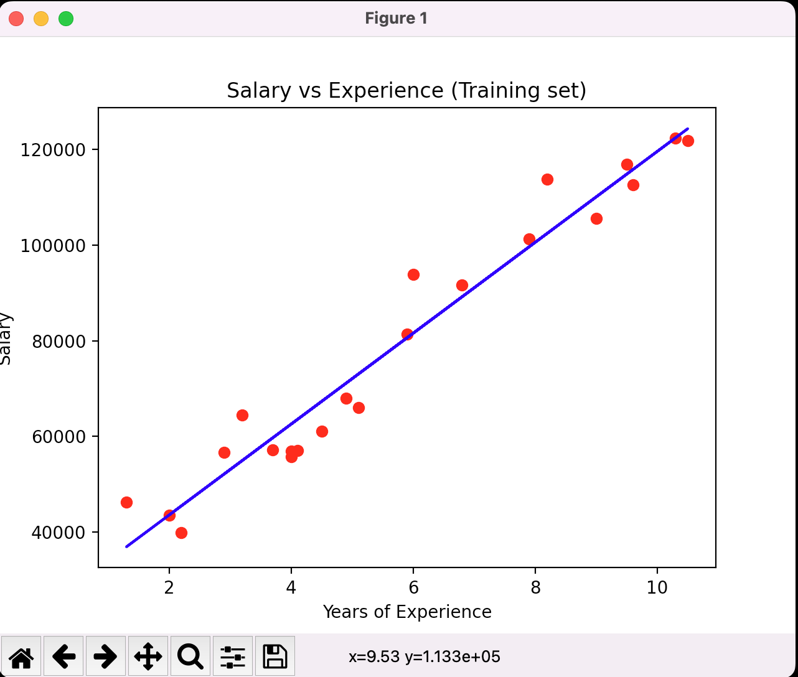
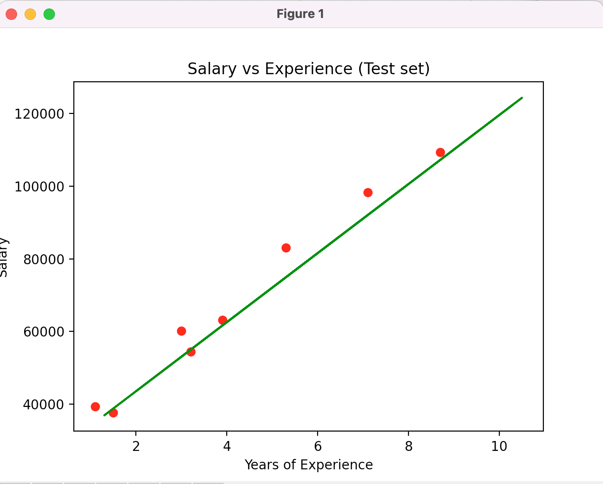
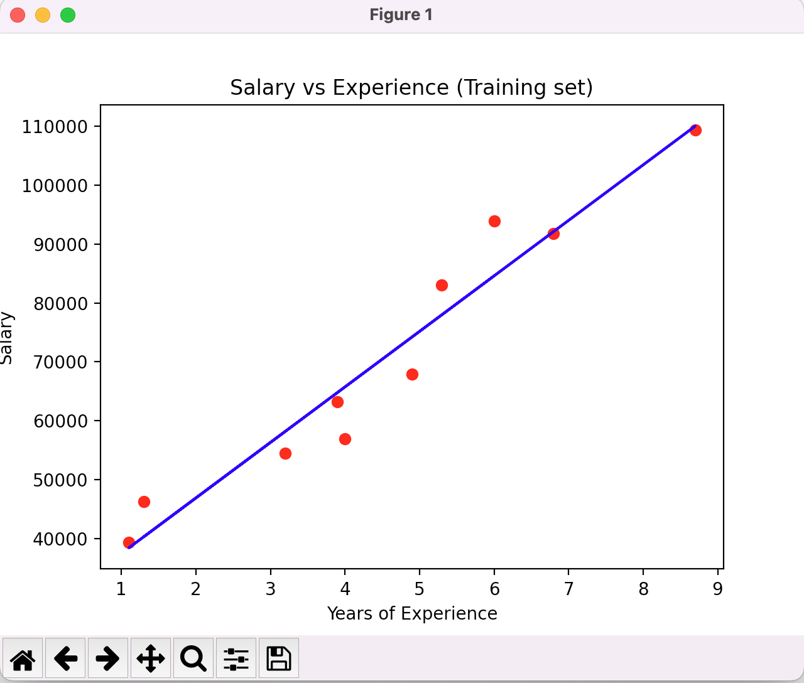
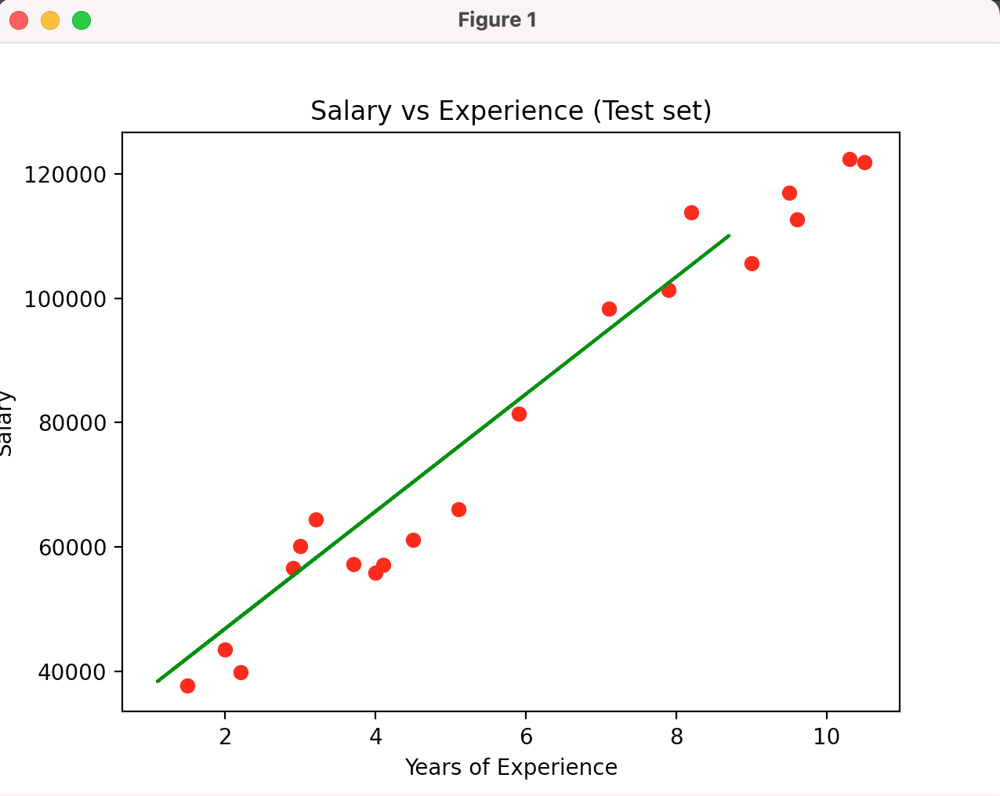

# systemy-ekspertowe

# TODO
Zadanie 2 - Utwórz sprawozdanie z przeprowadzonych analiz
• Sprawozdanie powinno zawierać:
- [x] Kod źródłowy wraz z wyjaśnieniem - MM, mamy w dir `lab01`
- [ ] Interpretację wyników
- [ ] Listę zbiorów wraz z ich omówieniem i podziałem
- [x] Wykresy wizualizacji wraz z interpretacją - MM dir `img`

# Lab 01

## Przypadek 1
test_size = 0.25
random=state = 150

Output
```
❯  cd /Users/miko/git/awsb/systemy-ekspertowe ; /usr/bin/env /Users/miko/git/awsb/systemy-ekspertowe/.venv/bin/python /Users/miko/.vscode/extensions/ms-python.python-2022.4.1/pythonFiles/lib/python/debugpy/launcher 50999 -- /Users/miko/git/awsb/systemy-ekspertowe/lab1/simple_linear_regression_student.py
Dataset values
    YearsExperience    Salary
0               1.1   39343.0
1               1.3   46205.0
2               1.5   37731.0
3               2.0   43525.0
4               2.2   39891.0
5               2.9   56642.0
6               3.0   60150.0
7               3.2   54445.0
8               3.2   64445.0
9               3.7   57189.0
10              3.9   63218.0
11              4.0   55794.0
12              4.0   56957.0
13              4.1   57081.0
14              4.5   61111.0
15              4.9   67938.0
16              5.1   66029.0
17              5.3   83088.0
18              5.9   81363.0
19              6.0   93940.0
20              6.8   91738.0
21              7.1   98273.0
22              7.9  101302.0
23              8.2  113812.0
24              8.7  109431.0
25              9.0  105582.0
26              9.5  116969.0
27              9.6  112635.0
28             10.3  122391.0
29             10.5  121872.0

X_train Dataset Description and values:
DescribeResult(nobs=22, minmax=(array([1.3]), array([10.5])), mean=array([5.70909091]), variance=array([8.15896104]), skewness=array([0.29353398]), kurtosis=array([-1.16359464]))
[[ 6.8]
 [ 4.9]
 [ 4. ]
 [ 8.2]
 [10.3]
 [ 4.1]
 [ 1.3]
 [ 4. ]
 [ 7.9]
 [ 6. ]
 [ 2. ]
 [ 3.2]
 [ 3.7]
 [ 2.9]
 [ 4.5]
 [10.5]
 [ 5.9]
 [ 5.1]
 [ 9. ]
 [ 9.6]
 [ 9.5]
 [ 2.2]]

X_test Dataset Description and values:
DescribeResult(nobs=8, minmax=(array([1.1]), array([8.7])), mean=array([4.225]), variance=array([7.04214286]), skewness=array([0.49784216]), kurtosis=array([-0.94384648]))
X_test Array Size: 8
[[3. ]
 [3.9]
 [1.1]
 [1.5]
 [7.1]
 [3.2]
 [5.3]
 [8.7]]

y_train Dataset Description and values:
DescribeResult(nobs=22, minmax=(39891.0, 122391.0), mean=78836.86363636363, variance=774595072.9805195, skewness=0.29697306930122913, kurtosis=-1.406986216700563)
[ 91738.  67938.  55794. 113812. 122391.  57081.  46205.  56957. 101302.
  93940.  43525.  64445.  57189.  56642.  61111. 121872.  81363.  66029.
 105582. 112635. 116969.  39891.]

y_test Dataset Description and values:
DescribeResult(nobs=8, minmax=(37731.0, 109431.0), mean=68209.875, variance=695134530.4107143, skewness=0.3739954847865596, kurtosis=-1.1919800732309815)
[ 60150.  63218.  39343.  37731.  98273.  54445.  83088. 109431.]

X_Train and y_train shape definition:
(22, 1)
(22,)

Intercept parameter and coefficient (slope):
Intercept (b) is :  24564.32049322976
Coefficient (m) is :  [9506.33717475]

y_pred Dataset Description and values:
DescribeResult(nobs=8, minmax=(35021.291385457786, 107269.45391357868), mean=64728.59505656012, variance=636401594.176549, skewness=0.4978421579538738, kurtosis=-0.9438464847503258)

Comparing Predicted Values vs Actual for Test set results:
     Actual        Predict
0   60150.0   53083.332017
1   63218.0   61639.035475
2   39343.0   35021.291385
3   37731.0   38823.826255
4   98273.0   92059.314434
5   54445.0   54984.599452
6   83088.0   74947.907519
7  109431.0  107269.453914

Comparing Predicted Values vs Actual + Variance for Test set results:
     Actual        Predict     Variance
0   60150.0   53083.332017  7066.667983
1   63218.0   61639.035475  1578.964525
2   39343.0   35021.291385  4321.708615
3   37731.0   38823.826255 -1092.826255
4   98273.0   92059.314434  6213.685566
5   54445.0   54984.599452  -539.599452
6   83088.0   74947.907519  8140.092481
7  109431.0  107269.453914  2161.546086

Score is :  96.25690537153099

Mean Absolute Error :  3889.3863703892375
Mean Squared Error :  22767100.359882142
Root Mean Squared Error :  4771.488275148766
```



## Przypadek 2

test_size = 0.66
random=state = 120

```
❯  cd /Users/miko/git/awsb/systemy-ekspertowe ; /usr/bin/env /Users/miko/git/awsb/systemy-ekspertowe/.venv/bin/python /Users/miko/.vscode/extensions/ms-python.python-2022.4.1/pythonFiles/lib/python/debugpy/launcher 51443 -- /Users/miko/git/awsb/systemy-ekspertowe/lab1/simple_linear_regression_student.py
Dataset values
    YearsExperience    Salary
0               1.1   39343.0
1               1.3   46205.0
2               1.5   37731.0
3               2.0   43525.0
4               2.2   39891.0
5               2.9   56642.0
6               3.0   60150.0
7               3.2   54445.0
8               3.2   64445.0
9               3.7   57189.0
10              3.9   63218.0
11              4.0   55794.0
12              4.0   56957.0
13              4.1   57081.0
14              4.5   61111.0
15              4.9   67938.0
16              5.1   66029.0
17              5.3   83088.0
18              5.9   81363.0
19              6.0   93940.0
20              6.8   91738.0
21              7.1   98273.0
22              7.9  101302.0
23              8.2  113812.0
24              8.7  109431.0
25              9.0  105582.0
26              9.5  116969.0
27              9.6  112635.0
28             10.3  122391.0
29             10.5  121872.0

X_train Dataset Description and values:
DescribeResult(nobs=10, minmax=(array([1.1]), array([8.7])), mean=array([4.52]), variance=array([5.564]), skewness=array([0.11236426]), kurtosis=array([-0.66684495]))
[[6. ]
 [1.3]
 [4. ]
 [5.3]
 [6.8]
 [8.7]
 [4.9]
 [3.9]
 [1.1]
 [3.2]]

X_test Dataset Description and values:
DescribeResult(nobs=20, minmax=(array([1.5]), array([10.5])), mean=array([5.71]), variance=array([9.15989474]), skewness=array([0.26885926]), kurtosis=array([-1.3933746]))
X_test Array Size: 20
[[ 4. ]
 [ 2. ]
 [10.3]
 [ 9.6]
 [ 5.1]
 [ 1.5]
 [ 3.2]
 [ 9.5]
 [ 2.9]
 [ 2.2]
 [ 7.9]
 [ 7.1]
 [ 8.2]
 [ 4.1]
 [10.5]
 [ 4.5]
 [ 3. ]
 [ 5.9]
 [ 9. ]
 [ 3.7]]

y_train Dataset Description and values:
DescribeResult(nobs=10, minmax=(39343.0, 109431.0), mean=70630.3, variance=526241098.23333335, skewness=0.291008839241123, kurtosis=-1.1253288184481411)
[ 93940.  46205.  56957.  83088.  91738. 109431.  67938.  63218.  39343.
  54445.]

y_test Dataset Description and values:
DescribeResult(nobs=20, minmax=(37731.0, 122391.0), mean=78689.35, variance=875043125.7131579, skewness=0.23155521474206187, kurtosis=-1.4888346983672696)
[ 55794.  43525. 122391. 112635.  66029.  37731.  64445. 116969.  56642.
  39891. 101302.  98273. 113812.  57081. 121872.  61111.  60150.  81363.
 105582.  57189.]

X_Train and y_train shape definition:
(10, 1)
(10,)

Intercept parameter and coefficient (slope):
Intercept (b) is :  28005.755851106303
Coefficient (m) is :  [9430.2088825]

y_pred Dataset Description and values:
DescribeResult(nobs=20, minmax=(42151.06917485421, 127022.94911734163), mean=81852.24857017331, variance=814578809.5083283, skewness=0.26885926249667647, kurtosis=-1.3933746025308231)

Comparing Predicted Values vs Actual for Test set results:
      Actual        Predict
0    55794.0   65726.591381
1    43525.0   46866.173616
2   122391.0  125136.907341
3   112635.0  118535.761123
4    66029.0   76099.821152
5    37731.0   42151.069175
6    64445.0   58182.424275
7   116969.0  117592.740235
8    56642.0   55353.361610
9    39891.0   48752.215393
10  101302.0  102504.406023
11   98273.0   94960.238917
12  113812.0  105333.468688
13   57081.0   66669.612269
14  121872.0  127022.949117
15   61111.0   70441.695822
16   60150.0   56296.382499
17   81363.0   83643.988258
18  105582.0  112877.635794
19   57189.0   62897.528716

Comparing Predicted Values vs Actual + Variance for Test set results:
      Actual        Predict      Variance
0    55794.0   65726.591381  -9932.591381
1    43525.0   46866.173616  -3341.173616
2   122391.0  125136.907341  -2745.907341
3   112635.0  118535.761123  -5900.761123
4    66029.0   76099.821152 -10070.821152
5    37731.0   42151.069175  -4420.069175
6    64445.0   58182.424275   6262.575725
7   116969.0  117592.740235   -623.740235
8    56642.0   55353.361610   1288.638390
9    39891.0   48752.215393  -8861.215393
10  101302.0  102504.406023  -1202.406023
11   98273.0   94960.238917   3312.761083
12  113812.0  105333.468688   8478.531312
13   57081.0   66669.612269  -9588.612269
14  121872.0  127022.949117  -5150.949117
15   61111.0   70441.695822  -9330.695822
16   60150.0   56296.382499   3853.617501
17   81363.0   83643.988258  -2280.988258
18  105582.0  112877.635794  -7295.635794
19   57189.0   62897.528716  -5708.528716

Score is :  95.25655818717182

Mean Absolute Error :  5482.510971323585
Mean Squared Error :  39431803.43008879
Root Mean Squared Error :  6279.474773425623
```


